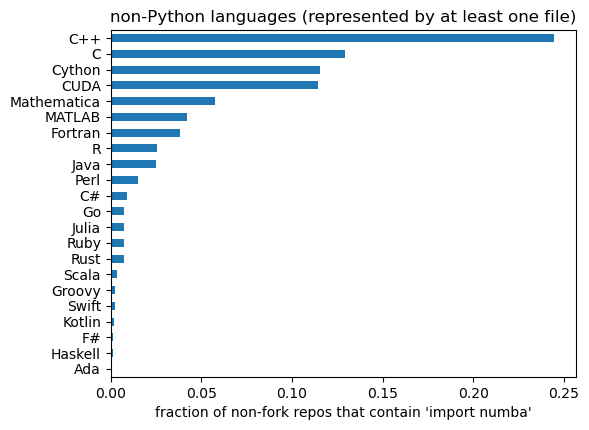
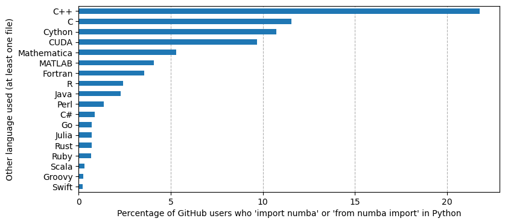
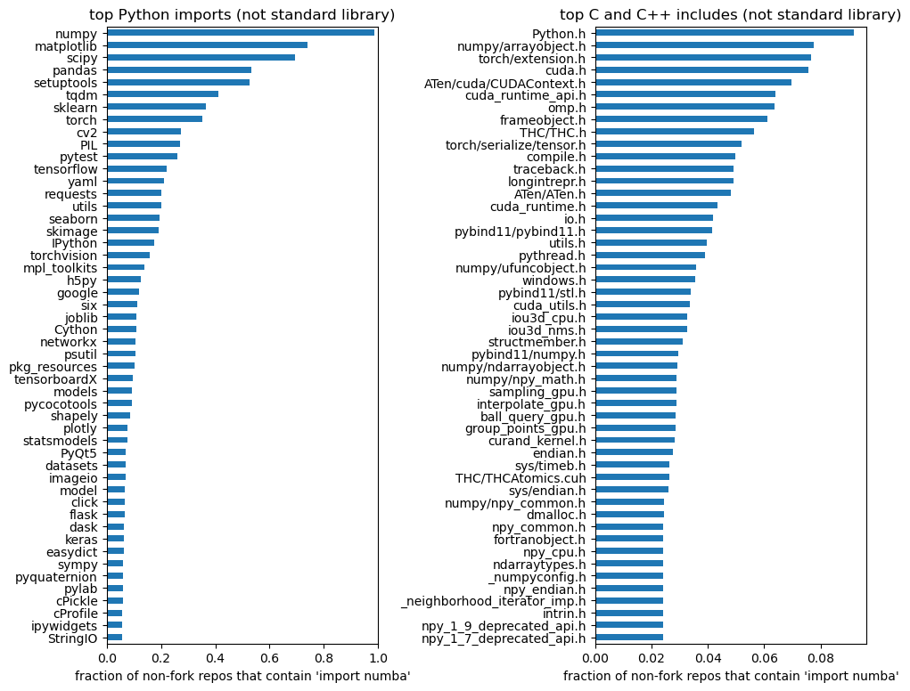
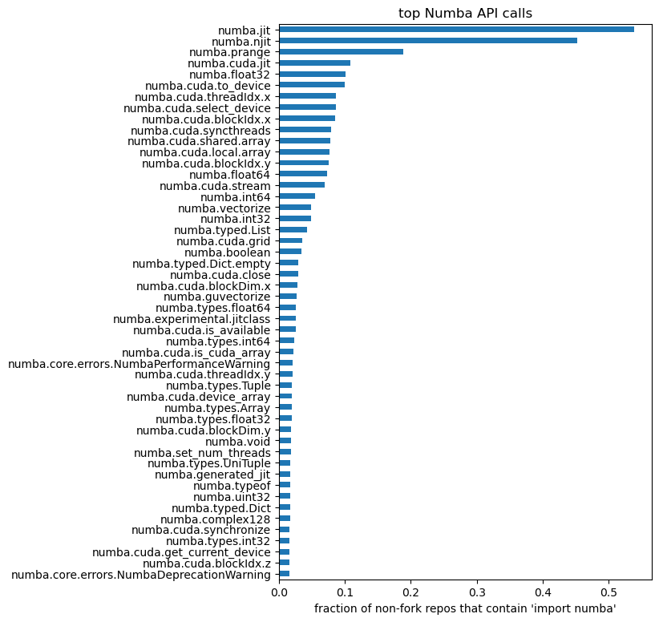
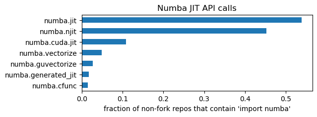
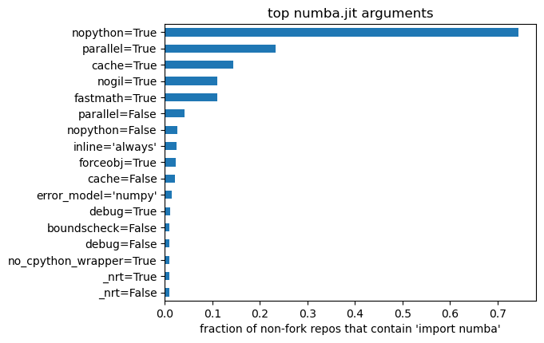

# Numba usage stats

Jim Pivarski

**Note:** The URLs to `https://pivarski-princeton.s3.amazonaws.com` will no longer work because those files have been removed. All but one have been moved to the [files-from-AWS](files-from-AWS) directory in this repository. The one that has not been saved, `GitHub-numba-user-nonfork-raw-data-1Mcut-imports.tar`, was 179.4 GB of repository data. If you're following the instructions below, you'll be able to produce an updated version of that dataset, but the original was too large to keep around. The other files are much smaller and serve as good checkpoints for testing that you're following the procedure correctly.

## How the data were collected

<br>

**Step 1:** Scrape the [dependents graph for numba/numba on GitHub](https://github.com/numba/numba/network/dependents) (the repositories, not the packages).

Web-scraping script in [step1.py](step1.py).

When I did it, there were 62903 of these.

<br><br><br>

**Step 2:** For each of those repos, [get the repo metadata using the GitHub API](https://docs.github.com/en/rest/repos/repos?apiVersion=2022-11-28#get-a-repository), taking care to not exceed the [rate limit](https://docs.github.com/en/rest/rate-limit/rate-limit?apiVersion=2022-11-28).

My list has 62900 of these. (I guess 3 were lost.)

My copy of the repo info can be found in [https://pivarski-princeton.s3.amazonaws.com/GitHub-numba-user-nonfork-REPO-INFO.tgz](https://pivarski-princeton.s3.amazonaws.com/GitHub-numba-user-nonfork-REPO-INFO.tgz) (32.1 MB).

My copy of the [user info, also from GitHub API](https://docs.github.com/en/rest/users/users?apiVersion=2022-11-28) (for bios) can be found in [https://pivarski-princeton.s3.amazonaws.com/GitHub-numba-user-nonfork-USER-INFO.tgz](https://pivarski-princeton.s3.amazonaws.com/GitHub-numba-user-nonfork-USER-INFO.tgz) (2.0 MB).

<br><br><br>

**Step 3:** For the repos in which `"fork": false` (users created the repo themselves), download all of the repos.

59233 repos from my previous list are non-fork.

I have the final results on a 380 GB disk, but I think I used a 1 TB disk during the process (all on AWS).

The [step3.py](step3.py) script performs the giant `git clone` of all these repos. It's a parallized pipeline (`ProcessPoolExecutor` with `max_workers=24` on a computer with 4 CPU cores... it's I/O limited) with the following steps:

1. `git clone` with `--depth 1` to get the latest snapshot, but not the history.
2. Do a `grep -i` for `\bnumba\b` to cross-check GitHub's identification of these as depending on Numba and keep the result in a `*.grep` file beside the final tarball.
3. Drop any files that are greater than 1 MB (some GitHub repos contain large data files) if they _do not_ have an interesting file suffix: `py`, `PY`, `ipynb`, `IPYNB`, `c`, `cc`, `cpp`, `cp`, `cxx`, `c++`, `C`, `CC`, `CPP`, `CP`, `CXX`, `C++`, `h`, `hpp`, `hp`, `hh`, `H`, `HPP`, `HP`, `HH`, `cu`, `cuh`, `CU`, `CUH`.
4. Tarball-and-compress what remains.

Occasionally, one of the 24 workers would get stuck with a large download, but the others moved past it. In the end, I think there were only a couple that couldn't be downloaded after a few attempts. (The script does not re-download, so it can be used to clean up after failed attempts.)

<br><br><br>

**Step 4:** Further select only the repos that actually contain

```regex
\b(import\s+([A-Za-z_][A-Za-z_0-9]*\s*,\s*)*numba|from\s+numba\s+import)\b
```

in some file. After this selection, only 13512 repos were kept (22.8%). Some of the repos that GitHub identified mentioned Numba in text or used it in markdown examples, but didn't import it: GitHub's interpretation of a "dependent repo" is very broad.

Finally, tarball (without compression!) the directory full of gzipped tarballs. My copy is at [https://pivarski-princeton.s3.amazonaws.com/GitHub-numba-user-nonfork-raw-data-1Mcut-imports.tar](https://pivarski-princeton.s3.amazonaws.com/GitHub-numba-user-nonfork-raw-data-1Mcut-imports.tar) (179.4 GB).

<br><br><br>

**Step 5:** Do a static code analysis on all of the Python and Jupyter notebook files. This is another `ProcessPoolExecutor` pipeline, which results in a JSON file that will be used in interactive analysis. The steps of the pipeline are:

1. Identify programming language by file extension, to learn which programming languages are used _alongside_ Numba.
2. For all C/C++/CUDA files,
  * try to parse it as a pure C file using [pycparser](https://github.com/eliben/pycparser) (mostly to distinguish between C and C++),
  * look for [CUDA's triple angle brackets](https://stackoverflow.com/q/77689913/1623645), and
  * regex-search it for `\s*#include [<\"](.*)[>\"]` to get a list of includes (and identify if the include-file name matches the name of a file in the repo, so that locally defined files can be excluded).
3. For all Python and Jupyter notebook files, parse the file with Python 3 (3.10.12) and indicate if parsing failed. For Jupyter, use [jupytext](https://github.com/mwouts/jupytext) to transform the Jupyter JSON into an in-memory pure Python, with IPython magics removed. Then, walk the Python AST to
  * collect all information on top-level imports and nested imports, keeping track of how imported modules or symbols are renamed,
  * if any of these are under the `numba` module, collect all symbol references and argument lists of function calls, including whether or not a function was used as a decorator, and
  * pay close attention to JIT-compilation functions/decorators: `numba.jit`, `numba.njit`, `numba.generated_jit`, `numba.vectorize`, `numba.guvectorize`, `numba.cfunc`.

My copy of the static analysis results is at [https://pivarski-princeton.s3.amazonaws.com/GitHub-numba-user-nonfork-static-analysis-results.jsons.gz](https://pivarski-princeton.s3.amazonaws.com/GitHub-numba-user-nonfork-static-analysis-results.jsons.gz) (77.0 MB).

<br><br><br>

## Analysis

<br>


```python
import json
from collections import Counter

import matplotlib.pyplot as plt
import numpy as np
import pandas as pd
```


```python
results = []
with open("static-analysis-results.jsons") as file:
    for line in file:
        results.append(json.loads(line))
```


```python
len(results)
```


    13511


```python
df = pd.DataFrame([{"suffix": cfile["suffix"], "is_c": cfile["data"]["is_c"], "is_cuda": cfile["data"]["num_cuda"] > 0} for result in results for cfile in result["c"]])
df
```


<div>
<table border="1" class="dataframe">
  <thead>
    <tr style="text-align: right;">
      <th></th>
      <th>suffix</th>
      <th>is_c</th>
      <th>is_cuda</th>
    </tr>
  </thead>
  <tbody>
    <tr>
      <th>0</th>
      <td>cpp</td>
      <td>True</td>
      <td>False</td>
    </tr>
    <tr>
      <th>1</th>
      <td>c</td>
      <td>False</td>
      <td>False</td>
    </tr>
    <tr>
      <th>2</th>
      <td>c</td>
      <td>False</td>
      <td>False</td>
    </tr>
    <tr>
      <th>3</th>
      <td>cpp</td>
      <td>False</td>
      <td>False</td>
    </tr>
    <tr>
      <th>4</th>
      <td>cpp</td>
      <td>False</td>
      <td>False</td>
    </tr>
    <tr>
      <th>...</th>
      <td>...</td>
      <td>...</td>
      <td>...</td>
    </tr>
    <tr>
      <th>897086</th>
      <td>h</td>
      <td>False</td>
      <td>False</td>
    </tr>
    <tr>
      <th>897087</th>
      <td>h</td>
      <td>False</td>
      <td>False</td>
    </tr>
    <tr>
      <th>897088</th>
      <td>h</td>
      <td>False</td>
      <td>False</td>
    </tr>
    <tr>
      <th>897089</th>
      <td>h</td>
      <td>False</td>
      <td>False</td>
    </tr>
    <tr>
      <th>897090</th>
      <td>c</td>
      <td>False</td>
      <td>False</td>
    </tr>
  </tbody>
</table>
<p>897091 rows × 3 columns</p>
</div>


The file extension is useless for determining if something is pure C versus C++.


```python
df["suffix"][df["is_c"]].value_counts()
```


    suffix
    h      9157
    cpp    3236
    c      3024
    hpp    2311
    cxx     160
    cc      106
    cuh      49
    cu       20
    hh        6
    hxx       5
    Name: count, dtype: int64


```python
df["suffix"][~df["is_c"]].value_counts()
```


    suffix
    h      401378
    cpp    194933
    c       85414
    cc      73949
    hpp     45596
    cu      40778
    cxx     24752
    cuh      6170
    hh       3046
    hxx      2982
    c++        13
    cp          3
    hp          3
    Name: count, dtype: int64


But it's a pretty good indicator that a CUDA file is a CUDA file (unless it's a header file, but then my method of checking for `<<<` `>>>` doesn't work, either).


```python
df["suffix"][df["is_cuda"]].value_counts()
```


    suffix
    cu     18197
    h       1274
    cuh      962
    c        101
    cpp       85
    hpp       82
    cc        73
    hxx        2
    hh         1
    Name: count, dtype: int64


```python
df["suffix"][~df["is_cuda"]].value_counts()
```


    suffix
    h      409261
    cpp    198084
    c       88337
    cc      73982
    hpp     47825
    cxx     24912
    cu      22601
    cuh      5257
    hh       3051
    hxx      2985
    c++        13
    cp          3
    hp          3
    Name: count, dtype: int64


```python
languages = []
for result in results:
    for pyfile in result["python"]:
        if pyfile["data"] is not None and any(x == "numba" or x.startswith("numba.") for x in list(pyfile["data"]["top"]) + list(pyfile["data"]["nested"])):
            break
    else:
        continue
    username, reponame = result["name"].split("/", 1)
    languages.append({"user": username, "repo": reponame})
    for cfile in result["c"]:
        if cfile["data"]["num_cuda"] > 0 or cfile["suffix"] in ("cu", "cuh"):
            languages[-1]["CUDA"] = True
        elif cfile["data"]["is_c"]:
            languages[-1]["C"] = True
        else:
            languages[-1]["C++"] = True
    for k, v in result["other_language"].items():
        if v > 0:
            languages[-1][k] = True

df = pd.DataFrame(languages).fillna(False)
df
```

    /tmp/ipykernel_76379/2710413475.py:21: FutureWarning: Downcasting object dtype arrays on .fillna, .ffill, .bfill is deprecated and will change in a future version. Call result.infer_objects(copy=False) instead. To opt-in to the future behavior, set `pd.set_option('future.no_silent_downcasting', True)`
      df = pd.DataFrame(languages).fillna(False)


<div>
<table border="1" class="dataframe">
  <thead>
    <tr style="text-align: right;">
      <th></th>
      <th>user</th>
      <th>repo</th>
      <th>C</th>
      <th>C++</th>
      <th>Cython</th>
      <th>Julia</th>
      <th>Swift</th>
      <th>Go</th>
      <th>CUDA</th>
      <th>Java</th>
      <th>...</th>
      <th>R</th>
      <th>Rust</th>
      <th>MATLAB</th>
      <th>Fortran</th>
      <th>Groovy</th>
      <th>Scala</th>
      <th>Kotlin</th>
      <th>F#</th>
      <th>Haskell</th>
      <th>Ada</th>
    </tr>
  </thead>
  <tbody>
    <tr>
      <th>0</th>
      <td>JeffreyMinucci</td>
      <td>ht_occupational</td>
      <td>False</td>
      <td>False</td>
      <td>False</td>
      <td>False</td>
      <td>False</td>
      <td>False</td>
      <td>False</td>
      <td>False</td>
      <td>...</td>
      <td>False</td>
      <td>False</td>
      <td>False</td>
      <td>False</td>
      <td>False</td>
      <td>False</td>
      <td>False</td>
      <td>False</td>
      <td>False</td>
      <td>False</td>
    </tr>
    <tr>
      <th>1</th>
      <td>dreamento</td>
      <td>dreamento</td>
      <td>False</td>
      <td>False</td>
      <td>False</td>
      <td>False</td>
      <td>False</td>
      <td>False</td>
      <td>False</td>
      <td>False</td>
      <td>...</td>
      <td>False</td>
      <td>False</td>
      <td>False</td>
      <td>False</td>
      <td>False</td>
      <td>False</td>
      <td>False</td>
      <td>False</td>
      <td>False</td>
      <td>False</td>
    </tr>
    <tr>
      <th>2</th>
      <td>nitin7478</td>
      <td>Backorder_Prediction</td>
      <td>False</td>
      <td>False</td>
      <td>False</td>
      <td>False</td>
      <td>False</td>
      <td>False</td>
      <td>False</td>
      <td>False</td>
      <td>...</td>
      <td>False</td>
      <td>False</td>
      <td>False</td>
      <td>False</td>
      <td>False</td>
      <td>False</td>
      <td>False</td>
      <td>False</td>
      <td>False</td>
      <td>False</td>
    </tr>
    <tr>
      <th>3</th>
      <td>exafmm</td>
      <td>pyexafmm</td>
      <td>False</td>
      <td>False</td>
      <td>False</td>
      <td>False</td>
      <td>False</td>
      <td>False</td>
      <td>False</td>
      <td>False</td>
      <td>...</td>
      <td>False</td>
      <td>False</td>
      <td>False</td>
      <td>False</td>
      <td>False</td>
      <td>False</td>
      <td>False</td>
      <td>False</td>
      <td>False</td>
      <td>False</td>
    </tr>
    <tr>
      <th>4</th>
      <td>astro-informatics</td>
      <td>sleplet</td>
      <td>False</td>
      <td>False</td>
      <td>False</td>
      <td>False</td>
      <td>False</td>
      <td>False</td>
      <td>False</td>
      <td>False</td>
      <td>...</td>
      <td>False</td>
      <td>False</td>
      <td>False</td>
      <td>False</td>
      <td>False</td>
      <td>False</td>
      <td>False</td>
      <td>False</td>
      <td>False</td>
      <td>False</td>
    </tr>
    <tr>
      <th>...</th>
      <td>...</td>
      <td>...</td>
      <td>...</td>
      <td>...</td>
      <td>...</td>
      <td>...</td>
      <td>...</td>
      <td>...</td>
      <td>...</td>
      <td>...</td>
      <td>...</td>
      <td>...</td>
      <td>...</td>
      <td>...</td>
      <td>...</td>
      <td>...</td>
      <td>...</td>
      <td>...</td>
      <td>...</td>
      <td>...</td>
      <td>...</td>
    </tr>
    <tr>
      <th>13087</th>
      <td>haowen-xu</td>
      <td>tensorkit</td>
      <td>False</td>
      <td>False</td>
      <td>False</td>
      <td>False</td>
      <td>False</td>
      <td>False</td>
      <td>False</td>
      <td>False</td>
      <td>...</td>
      <td>False</td>
      <td>False</td>
      <td>False</td>
      <td>False</td>
      <td>False</td>
      <td>False</td>
      <td>False</td>
      <td>False</td>
      <td>False</td>
      <td>False</td>
    </tr>
    <tr>
      <th>13088</th>
      <td>WONDER-project</td>
      <td>OASYS1-WONDER</td>
      <td>False</td>
      <td>False</td>
      <td>False</td>
      <td>False</td>
      <td>False</td>
      <td>False</td>
      <td>False</td>
      <td>False</td>
      <td>...</td>
      <td>False</td>
      <td>False</td>
      <td>False</td>
      <td>False</td>
      <td>False</td>
      <td>False</td>
      <td>False</td>
      <td>False</td>
      <td>False</td>
      <td>False</td>
    </tr>
    <tr>
      <th>13089</th>
      <td>WONDER-project</td>
      <td>Orange3-WONDER</td>
      <td>False</td>
      <td>False</td>
      <td>False</td>
      <td>False</td>
      <td>False</td>
      <td>False</td>
      <td>False</td>
      <td>False</td>
      <td>...</td>
      <td>False</td>
      <td>False</td>
      <td>False</td>
      <td>False</td>
      <td>False</td>
      <td>False</td>
      <td>False</td>
      <td>False</td>
      <td>False</td>
      <td>False</td>
    </tr>
    <tr>
      <th>13090</th>
      <td>maciej-sypetkowski</td>
      <td>autoascend</td>
      <td>False</td>
      <td>False</td>
      <td>False</td>
      <td>False</td>
      <td>False</td>
      <td>False</td>
      <td>False</td>
      <td>False</td>
      <td>...</td>
      <td>False</td>
      <td>False</td>
      <td>False</td>
      <td>False</td>
      <td>False</td>
      <td>False</td>
      <td>False</td>
      <td>False</td>
      <td>False</td>
      <td>False</td>
    </tr>
    <tr>
      <th>13091</th>
      <td>FS-CSCI150-F21</td>
      <td>FS-CSCI150-F21-Team4</td>
      <td>True</td>
      <td>True</td>
      <td>True</td>
      <td>False</td>
      <td>False</td>
      <td>False</td>
      <td>False</td>
      <td>False</td>
      <td>...</td>
      <td>False</td>
      <td>False</td>
      <td>True</td>
      <td>True</td>
      <td>False</td>
      <td>False</td>
      <td>False</td>
      <td>False</td>
      <td>False</td>
      <td>False</td>
    </tr>
  </tbody>
</table>
<p>13092 rows × 24 columns</p>
</div>


```python
len(df) / len(results)
```


    0.9689882318111168


In the following, "C++" and "C" are mutually exclusive categories of file ("does it compile in pycparser or not?"), but the bars are not mutually exclusive because a repo can contain a C++ file _and also_ a pure C file.

"CUDA" is not exclusive with respect to "C++" and "C"; it corresponds to any C-like file with `<<<` `>>>` in it.


```python
fig, ax = plt.subplots(figsize=(6, 4.5))

(df.drop(columns=["user", "repo"]).sum(axis=0).sort_values() / len(df)).plot.barh(ax=ax)
ax.set_xlabel("fraction of non-fork repos that contain 'import numba'")
ax.set_title("non-Python languages (represented by at least one file)")

None
```


    

    


```python
fig, ax = plt.subplots(figsize=(9, 4))

(df.drop(columns=["repo"]).groupby("user").any().sum(axis=0).sort_values()[4:] * 100 / len(df)).plot.barh(ax=ax)
ax.set_xlabel("Percentage of GitHub users who 'import numba' or 'from numba import' in Python")
ax.set_ylabel("Other language used (at least one file)")
ax.xaxis.grid(linestyle="--")
ax.set_axisbelow(True)

# fig.savefig("numba-users-other-language.svg")
# fig.savefig("numba-users-other-language.pdf")
```


    

    


```python
df.drop(columns=["repo"]).groupby("user").any().sum(axis=0).sort_values()
```


    Ada               1
    Haskell          13
    F#               14
    Kotlin           24
    Swift            29
    Groovy           32
    Scala            43
    Ruby             90
    Rust             91
    Julia            92
    Go               93
    C#              115
    Perl            177
    Java            300
    R               317
    Fortran         465
    MATLAB          533
    Mathematica     692
    CUDA           1270
    Cython         1406
    C              1511
    C++            2850
    dtype: int64


```python
STDLIB_MODULES = {
    "__main__",
    "string",
    "re",
    "difflib",
    "textwrap",
    "unicodedata",
    "stringprep",
    "readline",
    "rlcompleter",
    "struct",
    "codecs",
    "datetime",
    "calendar",
    "collections",
    "heapq",
    "bisect",
    "array",
    "weakref",
    "types",
    "copy",
    "pprint",
    "reprlib",
    "enum",
    "numbers",
    "math",
    "cmath",
    "decimal",
    "fractions",
    "random",
    "statistics",
    "itertools",
    "functools",
    "operator",
    "pathlib",
    "fileinput",
    "stat",
    "filecmp",
    "tempfile",
    "glob",
    "fnmatch",
    "linecache",
    "shutil",
    "macpath",
    "pickle",
    "copyreg",
    "shelve",
    "marshal",
    "dbm",
    "sqlite3",
    "zlib",
    "gzip",
    "bz2",
    "lzma",
    "zipfile",
    "tarfile",
    "csv",
    "configparser",
    "netrc",
    "xdrlib",
    "plistlib",
    "hashlib",
    "hmac",
    "secrets",
    "os",
    "io",
    "time",
    "argparse",
    "getopt",
    "logging",
    "getpass",
    "curses",
    "platform",
    "errno",
    "ctypes",
    "threading",
    "multiprocessing",
    "concurrent",
    "subprocess",
    "sched",
    "queue",
    "_thread",
    "_dummy_thread",
    "dummy_threading",
    "contextvars",
    "asyncio",
    "socket",
    "ssl",
    "select",
    "selectors",
    "asyncore",
    "asynchat",
    "signal",
    "mmap",
    "email",
    "json",
    "mailcap",
    "mailbox",
    "mimetypes",
    "base64",
    "binhex",
    "binascii",
    "quopri",
    "uu",
    "html",
    "xml",
    "webbrowser",
    "cgi",
    "cgitb",
    "wsgiref",
    "urllib",
    "ftplib",
    "poplib",
    "imaplib",
    "nntplib",
    "smtplib",
    "smtpd",
    "telnetlib",
    "uuid",
    "socketserver",
    "xmlrpc",
    "ipaddress",
    "audioop",
    "aifc",
    "sunau",
    "wave",
    "chunk",
    "colorsys",
    "imghdr",
    "sndhdr",
    "ossaudiodev",
    "gettext",
    "locale",
    "turtle",
    "cmd",
    "shlex",
    "tkinter",
    "typing",
    "pydoc",
    "doctest",
    "unittest",
    "lib2to3",
    "test",
    "bdb",
    "faulthandler",
    "pdb",
    "timeit",
    "trace",
    "tracemalloc",
    "distutils",
    "ensurepip",
    "venv",
    "zipapp",
    "sys",
    "sysconfig",
    "builtins",
    "warnings",
    "dataclasses",
    "contextlib",
    "abc",
    "atexit",
    "traceback",
    "__future__",
    "gc",
    "inspect",
    "site",
    "code",
    "codeop",
    "zipimport",
    "pkgutil",
    "modulefinder",
    "runpy",
    "importlib",
    "parser",
    "ast",
    "symtable",
    "symbol",
    "token",
    "keyword",
    "tokenize",
    "tabnanny",
    "pyclbr",
    "py_compile",
    "compileall",
    "dis",
    "pickletools",
    "formatter",
    "msilib",
    "msvcrt",
    "winreg",
    "winsound",
    "posix",
    "pwd",
    "spwd",
    "grp",
    "crypt",
    "termios",
    "tty",
    "pty",
    "fcntl",
    "pipes",
    "resource",
    "nis",
    "syslog",
    "optparse",
    "imp",
    "posixpath",
    "ntpath",
}
```


```python
# https://stackoverflow.com/a/2029106/1623645

C_STDLIB_MODULES = set([
    "aio.h",
    "algorithm",
    "any",
    "arpa/inet.h",
    "array",
    "assert.h",
    "atomic",
    "barrier",
    "bit",
    "bitset",
    "cassert",
    "ccomplex",
    "cctype",
    "cerrno",
    "cfenv",
    "cfloat",
    "charconv",
    "chrono",
    "cinttypes",
    "ciso646",
    "climits",
    "clocale",
    "cmath",
    "codecvt",
    "compare",
    "complex",
    "complex.h",
    "concepts",
    "condition_variable",
    "coroutine",
    "cpio.h",
    "csetjmp",
    "csignal",
    "cstdalign",
    "cstdarg",
    "cstdbool",
    "cstddef",
    "cstdint",
    "cstdio",
    "cstdlib",
    "cstring",
    "ctgmath",
    "ctime",
    "ctype.h",
    "cuchar",
    "curses.h",
    "cwchar",
    "cwctype",
    "deque",
    "dirent.h",
    "dlfcn.h",
    "errno.h",
    "exception",
    "execution",
    "expected",
    "fcntl.h",
    "fenv.h",
    "filesystem",
    "flat_map",
    "flat_set",
    "float.h",
    "fmtmsg.h",
    "fnmatch.h",
    "format",
    "forward_list",
    "fstream",
    "ftw.h",
    "functional",
    "future",
    "generator",
    "glob.h",
    "grp.h",
    "iconv.h",
    "initializer_list",
    "inttypes.h",
    "iomanip",
    "ios",
    "iosfwd",
    "iostream",
    "iso646.h",
    "istream",
    "iterator",
    "langinfo.h",
    "latch",
    "libgen.h",
    "limits",
    "limits.h",
    "list",
    "locale",
    "locale.h",
    "map",
    "math.h",
    "mdspan",
    "memory",
    "memory_resource",
    "monetary.h",
    "mqueue.h",
    "mutex",
    "ndbm.h",
    "netdb.h",
    "net/if.h",
    "netinet/in.h",
    "netinet/tcp.h",
    "new",
    "nl_types.h",
    "numbers",
    "numeric",
    "optional",
    "ostream",
    "poll.h",
    "print",
    "pthread.h",
    "pwd.h",
    "queue",
    "random",
    "ranges",
    "ratio",
    "regex",
    "regex.h",
    "sched.h",
    "scoped_allocator",
    "search.h",
    "semaphore",
    "semaphore.h",
    "set",
    "setjmp.h",
    "shared_mutex",
    "signal.h",
    "source_location",
    "span",
    "spanstream",
    "spawn.h",
    "sstream",
    "stack",
    "stacktrace",
    "stdalign.h",
    "stdarg.h",
    "stdatomic.h",
    "stdbit.h",
    "stdbool.h",
    "stdckdint.h",
    "stddef.h",
    "stdexcept",
    "stdfloat",
    "stdint.h",
    "stdio.h",
    "stdlib.h",
    "stdnoreturn.h",
    "stop_token",
    "streambuf",
    "string",
    "string.h",
    "strings.h",
    "string_view",
    "stropts.h",
    "strstream",
    "syncstream",
    "sys/ipc.h",
    "syslog.h",
    "sys/mman.h",
    "sys/msg.h",
    "sys/resource.h",
    "sys/select.h",
    "sys/sem.h",
    "sys/shm.h",
    "sys/socket.h",
    "sys/stat.h",
    "sys/statvfs.h",
    "system_error",
    "sys/time.h",
    "sys/times.h",
    "sys/types.h",
    "sys/uio.h",
    "sys/un.h",
    "sys/utsname.h",
    "sys/wait.h",
    "tar.h",
    "term.h",
    "termios.h",
    "tgmath.h",
    "thread",
    "threads.h",
    "time.h",
    "trace.h",
    "tuple",
    "typeindex",
    "typeinfo",
    "type_traits",
    "uchar.h",
    "ulimit.h",
    "uncntrl.h",
    "unistd.h",
    "unordered_map",
    "unordered_set",
    "utility",
    "utime.h",
    "utmpx.h",
    "valarray",
    "variant",
    "vector",
    "version",
    "wchar.h",
    "wctype.h",
    "wordexp.h",
])
```


```python
num_with_numba = 0
python_imports = Counter()
c_imports = Counter()
for result in results:
    for pyfile in result["python"]:
        if pyfile["data"] is not None and any(x == "numba" or x.startswith("numba.") for x in list(pyfile["data"]["top"]) + list(pyfile["data"]["nested"])):
            break
    else:
        continue
    num_with_numba += 1

    counter = Counter()
    for pyfile in result["python"]:
        if pyfile["data"] is not None:
            for x in list(pyfile["data"]["top"]) + list(pyfile["data"]["nested"]):
                if x not in STDLIB_MODULES and x != "numba":
                    counter[x] += 1
    for x in counter:
        python_imports[x] += 1

    counter = Counter()
    for cfile in result["c"]:
        if cfile["data"] is not None:
            for x in list(cfile["data"]["global"]) + list(cfile["data"]["local"]):
                if x not in C_STDLIB_MODULES and x != "numba":
                    counter[x] += 1
    for x in counter:
        c_imports[x] += 1

python_imports = sorted(python_imports.items(), key=lambda x: -x[1])
c_imports = sorted(c_imports.items(), key=lambda x: -x[1])
```


```python
fig, (ax1, ax2) = plt.subplots(1, 2, figsize=(11, 9))

(pd.Series(dict(python_imports[:50])).sort_values() / num_with_numba).plot.barh(ax=ax1)
ax1.set_xlabel("fraction of non-fork repos that contain 'import numba'")
ax1.set_title("top Python imports (not standard library)")
ax1.set_xlim(0, 1)

(pd.Series(dict(c_imports[:50])).sort_values() / num_with_numba).plot.barh(ax=ax2)
ax2.set_xlabel("fraction of non-fork repos that contain 'import numba'")
ax2.set_title("top C and C++ includes (not standard library)")
# ax2.set_xlim(0, 1)

plt.subplots_adjust(wspace=0.8)

None
```


    

    


```python
num_with_numba = 0
numba_references = Counter()
for result in results:
    for pyfile in result["python"]:
        if pyfile["data"] is not None and any(x == "numba" or x.startswith("numba.") for x in list(pyfile["data"]["top"]) + list(pyfile["data"]["nested"])):
            break
    else:
        continue
    num_with_numba += 1

    counter = Counter()
    for pyfile in result["python"]:
        if pyfile["data"] is not None:
            for x in pyfile["data"]["numba"]:
                y = x.lstrip("@").split("(")[0]
                if x.startswith("numba.jit") and "nopython=True" in x:
                    y = "numba.njit"
                counter[y] += 1

    for x in counter:
        numba_references[x] += 1

numba_references = sorted(numba_references.items(), key=lambda x: -x[1])
```


```python
fig, ax = plt.subplots(figsize=(6, 9))

(pd.Series(dict(numba_references[:50])).sort_values() / num_with_numba).plot.barh(ax=ax)
ax.set_xlabel("fraction of non-fork repos that contain 'import numba'")
ax.set_title("top Numba API calls")
# ax1.set_xlim(0, 1)

None
```


    

    


```python
JIT_FUNCTIONS = {"numba.jit", "numba.njit", "numba.generated_jit", "numba.vectorize", "numba.guvectorize", "numba.cfunc", "numba.cuda.jit"}
```


```python
fig, ax = plt.subplots(figsize=(6, 2))

(pd.Series({k: v for k, v in numba_references if k in JIT_FUNCTIONS}).sort_values() / num_with_numba).plot.barh(ax=ax)
ax.set_xlabel("fraction of non-fork repos that contain 'import numba'")
ax.set_title("Numba JIT API calls")
# ax1.set_xlim(0, 1)

None
```


    

    


```python
num_with_numba = 0
jit_arguments = Counter()
for result in results:
    for pyfile in result["python"]:
        if pyfile["data"] is not None and any(x == "numba" or x.startswith("numba.") for x in list(pyfile["data"]["top"]) + list(pyfile["data"]["nested"])):
            break
    else:
        continue
    num_with_numba += 1

    counter = Counter()
    for pyfile in result["python"]:
        if pyfile["data"] is not None:
            for x in pyfile["data"]["numba"]:
                if "(" in x and (x.lstrip("@").startswith("numba.jit") or x.lstrip("@").startswith("numba.njit")):
                    for arg in x.split("(", 1)[1].rstrip(")").split(","):
                        if "=" in arg:
                            counter[arg.strip()] += 1
                if x.lstrip("@").startswith("numba.njit"):
                    counter["nopython=True"] += 1

    for x in counter:
        jit_arguments[x] += 1

jit_arguments = sorted(jit_arguments.items(), key=lambda x: -x[1])
```


```python
fig, ax = plt.subplots(figsize=(6, 4.5))

(pd.Series(dict(jit_arguments[:17])).sort_values() / num_with_numba).plot.barh(ax=ax)
ax.set_xlabel("fraction of non-fork repos that contain 'import numba'")
ax.set_title("top numba.jit arguments")
# ax1.set_xlim(0, 1)

None
```


    

    


```python
num_with_numba = 0
num_with_numba_cuda = 0
for result in results:
    for pyfile in result["python"]:
        if pyfile["data"] is not None and any(x == "numba" or x.startswith("numba.") for x in list(pyfile["data"]["top"]) + list(pyfile["data"]["nested"])):
            break
    else:
        continue
    num_with_numba += 1

    any_cuda = False
    for pyfile in result["python"]:
        if pyfile["data"] is not None:
            for x in pyfile["data"]["numba"]:
                if x.startswith("numba.cuda"):
                    any_cuda = True

    if any_cuda:
        num_with_numba_cuda += 1

num_with_numba_cuda / num_with_numba
```


    0.13978001833180567


